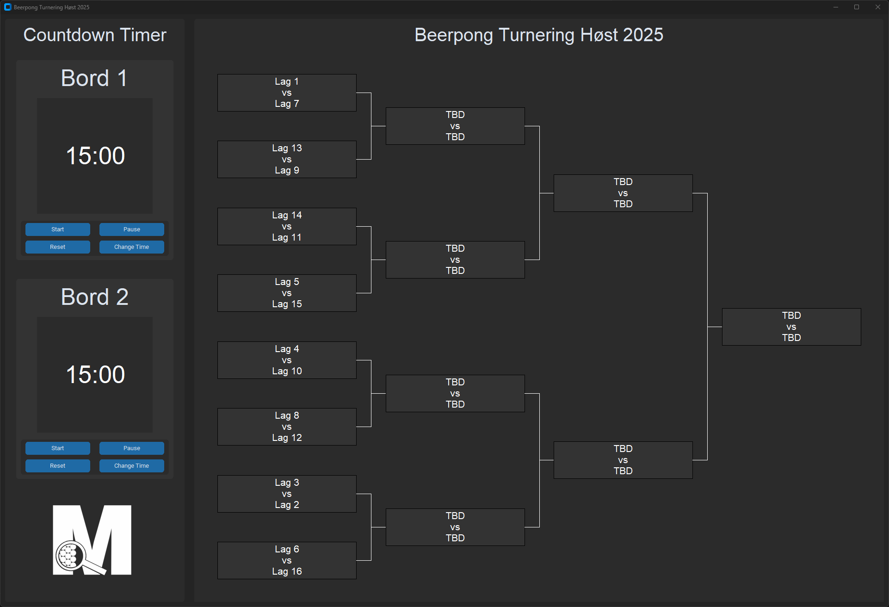
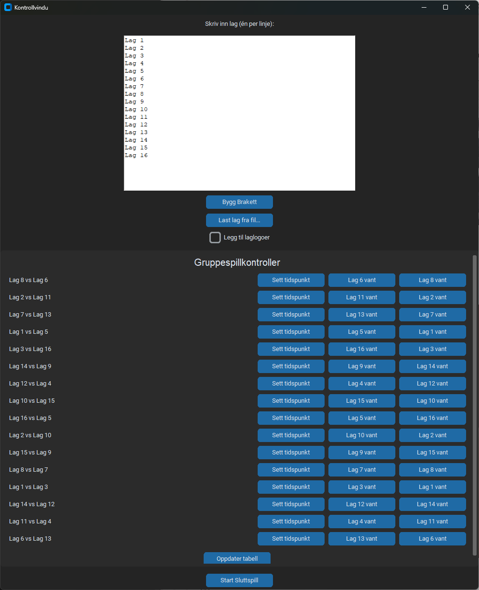
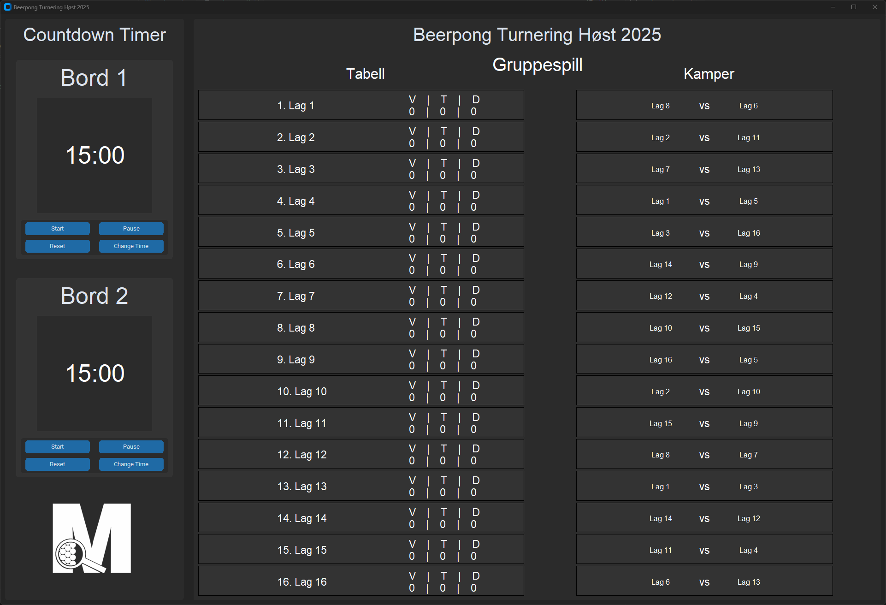

# 🍻 Beerpong Turnering

Et komplett grafisk Python-program for å organisere og visualisere en **beerpong-turnering**.  
Programmet håndterer både **gruppespill** og **sluttspill**, med automatisk kampoppsett, visning av tabeller og et moderne brukergrensesnitt bygget med `customtkinter`.  
Det inkluderer også nedtellingstimere og støtte for laglogoer.

---

## ✨ Hovedfunksjoner

- Gruppespill med automatisk kampgenerering  
- Sluttspill (bracket-visning) med visuell progresjon  
- Dynamisk **kontrollvindu** for å:
  - legge inn lag manuelt eller laste fra fil  
  - angi vinnere, kamptidspunkter og resultater  
  - redigere eller angre kampresultater  
- Støtte for **laglogoer** (bruker valgfritt bilde per lag)  
- To **nedtellingstimere** med sirkulær fremdriftsindikator  
- Automatisk rangeringssystem basert på poeng og differanse  
- Ferdig kompilert **Windows-versjon (.exe)** for enkel oppstart

---

## 🧩 Katalogstruktur

```text
.
├── main.py              # Hovedprogrammet – starter GUI med timere og turneringsvisning
├── brackets.py          # All logikk for turneringsstruktur, gruppespill og kontrollvindu
├── timer.py             # Modul med visuell nedtelling
├── graphics/
│   └── menageriet_logo.png   # (valgfritt) logo som vises i programmet
└── teams/               # Mappe for laglister
    ├── teams_names.txt          # Kun lagnavn
    └── teams_with_logos.csv     # Lagnavn + filbane til logo
```

## 🚀 Kjøring
### 💾 Ferdigkompilert versjon (.exe)

Du kan laste ned og kjøre den ferdige versjonen uten å installere Python.  
Last ned **kun** følgende filer/mappestruktur som ligger i relase:

```text
Brackets.exe
teams/
│
├── teams_names.txt
└── teams_with_logos.csv
```

📦 **Last ned her:** [Klikk for å laste ned Brackets (exe + teams)](https://github.com/khthorse/brackets/archive/refs/heads/release.zip)

Etter nedlasting:
1. Pakk ut mappen (hvis den kommer som zip)
2. Sørg for at `teams/`-mappen ligger i samme mappe som `.exe`-filen
3. Dobbeltklikk på `Beerpong_Turnering.exe` for å starte programmet  
   *(ingen installasjon nødvendig!)*


---

## ⚙️ Krav og installasjon

### Python-versjon
Python **3.12** eller nyere anbefales (kun hvis du kjører fra kildekode).

### Installer nødvendige pakker
```bash
pip install customtkinter pillow
```

> `customtkinter` gir moderne GUI-komponenter  
> `pillow` brukes til bildehåndtering for laglogoer

---

## 🚀 Kjøring

### 🖥️ Fra kildekode

Kjør hovedprogrammet:

```bash
python main.py
```

Dette åpner hovedvinduet med:
- **to nedtellingstimere** til venstre  
- **turneringsbraketten** og kontrollvindu til høyre  

---

## 🏆 Brukerveiledning

1. **Start programmet**
2. I kontrollvinduet:
   - Legg inn lag manuelt (ett per linje), eller
   - Trykk **“Last lag fra fil”** og velg en fil fra `teams/`
3. Aktiver “**Legg til laglogoer**” for å velge bilder per lag (valgfritt)
4. Trykk **“Start Gruppespill”** for å generere kamper
5. Sett vinnere og kamptider fortløpende
6. Når gruppespillet er ferdig, trykk **“Start Sluttspill”**
7. Følg turneringsbraketten til en vinner er kåret 🏆

---

## 📄 Format for lagfiler (`teams/`)

Du kan legge lag inn på to måter:

### 1️⃣ Kun navn
`teams_names.csv`
```
Team Alpha
Team Bravo
Team Charlie
Team Delta
```

### 2️⃣ Navn og logo-filbane
`teams_with_logos.csv`
```
Team Alpha;Teams/team_logos/alpha.png
Team Bravo;Teams/team_logos/bravo.jpg
```

Kommentarlinjer (`# ...`) og tomme linjer ignoreres.

---

## 💡 Tips

- Programmet husker valget om du vil bruke logoer  
- Du kan endre kamptid, redigere eller angre resultater underveis  
- Gruppespilltabellen oppdateres automatisk etter hver kamp  
- Braketten vises dynamisk når sluttspillet starter  
- Timerne kan pauses, resettes eller justeres med “Change Time”

---

## 🧱 Utviklernotater

- Utviklet i **Python** med `customtkinter`-grensesnitt  
- Bruker `Pillow` for bildehåndtering  
- Støtter både **tekstinput** og **CSV-import** for lag  
- Klart til pakking med **PyInstaller**  
  ```bash
  pyinstaller --onefile --noconsole main.py
  ```

---

## 🪪 Lisens


Dette prosjektet er lisensiert under **Creative Commons Attribution-NonCommercial-ShareAlike 4.0 International (CC BY-NC-SA 4.0)**.

Du kan:
- Dele — kopiere og distribuere materialet i hvilket som helst medium eller format  
- Remikse — endre, bygge videre eller tilpasse materialet  

Så lenge du:
- Gir **kreditering** til opphavspersonen  
- **Ikke bruker det kommersielt**  
- Deler videre **under samme lisens**  

📄 [Les hele lisensen her](https://creativecommons.org/licenses/by-nc-sa/4.0/deed.no)


---

### 🎯 Eksempelvisning

<p align="left">
  
  <align="right">
  
</p>
<p align="center">
  
</p>
